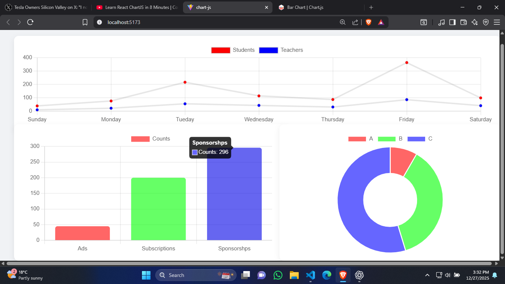

🚀 Exploring Chart.js in React!

Built a small dashboard with three chart types:

📊 Bar Chart for revenue comparisons

🍩 Doughnut Chart for category distribution

📈 Line Chart for trends over time

Using react-chartjs-2 makes it super easy to integrate Chart.js into React apps. The charts are fully responsive, dynamic, and visually clean.

